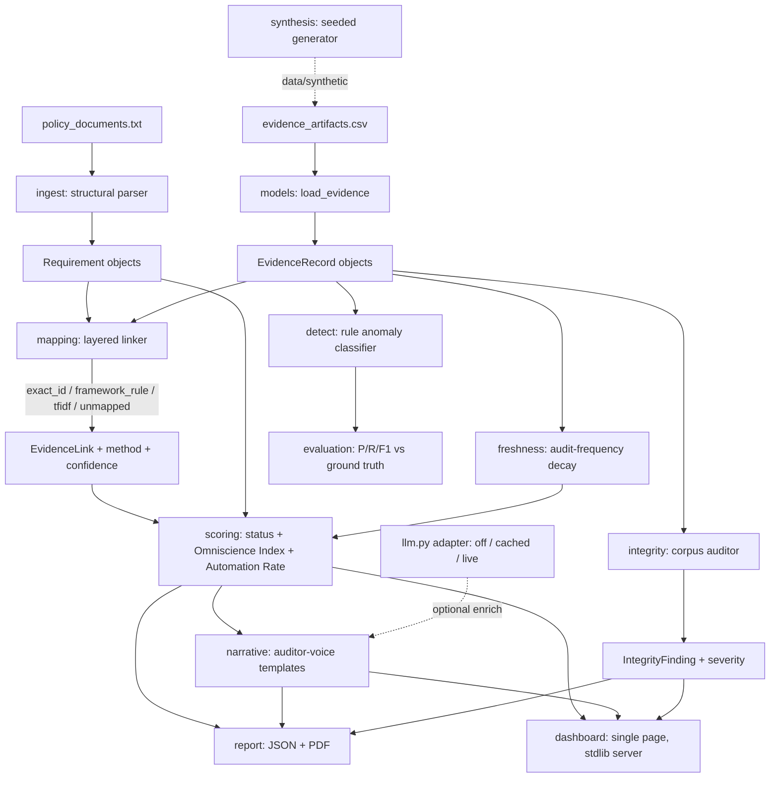

# OMNIS

The partly omniscient auditor. A compliance evidence engine that parses security
policies into requirements, links evidence to them, tracks freshness and
confidence, detects anomalies, and generates auditor-ready reports. Every output
carries confidence, freshness, and explicit gaps: the system quantifies its own
ignorance.

Built solo for the Societe Generale iHACK MYPLACE hackathon, Problem Statement 3
(Automated Compliance Evidence Collection & Audit). Team: Partly Everything.

<!-- TODO(human): hero screenshot of the dashboard goes here. -->


## Three numbers

<!-- TODO(human): pull these into one bold line of prose. Verified values below. -->
**[THREE BOLD NUMBERS HERE]**

- Detector on the synthetic bench: precision 0.941, recall 0.964 (bar: P > 0.70,
  R > 0.60). Source: `make eval`.
- Omniscience Index 92.6 / 100, Automation Rate 64.4% on the synthetic bench.
  Source: `make score`.
- Full pipeline on 15 requirements + 5,000 evidence rows: 0.043s (bar: < 60s).
  Source: `make perf`.

## Architecture



The package is a modular monolith under `omnis/`: `ingest`, `integrity`,
`mapping`, `freshness`, `scoring`, `detect`, `narrative`, `report`, `evaluation`,
`synthesis`, `dashboard`, plus the `llm.py` adapter and the `cli.py` entrypoint.

## Quickstart

Runs offline on a clean machine. Python 3.10+. No API key required.

```bash
git clone <repo-url> omnis
cd omnis
pip install -r requirements.txt

make test     # 97 tests
make demo     # serve the dashboard at http://127.0.0.1:8000
```

Headless commands (real output numbers shown):

```bash
# Parse policies + audit the provided evidence corpus.
python -m omnis run
#   Parsed 9 requirements, 500 evidence records, 5 integrity findings
#   Omniscience Index 64.4/100, Automation Rate 48.6%

# Score detectors on both benches (the bar applies to the synthetic bench).
python -m omnis eval
#   rules on synthetic bench: precision 0.941, recall 0.964, f1 0.952 -> PASS

# Map evidence + score compliance on both benches.
python -m omnis score
#   synthetic bench: Omniscience Index 92.6/100, Automation 64.4%, 15 requirements

# Auditor-ready JSON + PDF report (synthetic bench shows 15 requirements).
python -m omnis report --bench synthetic
#   Wrote reports/report.json and reports/report.pdf

# Time the full pipeline at scale.
python -m omnis perf --n 5000
#   15 requirements + 5000 evidence rows: TOTAL 0.043s -> PASS (< 60s)

# Reproduce the label-independence finding.
make analyze
```

Two evaluation benches: the **provided sample** (3 policies, 9 requirements, 500
evidence rows) is the primary set; the **synthetic bench** (6 policies, 15
requirements, seeded generator) restores the advertised enterprise scope and
carries ground-truth labels by construction. See
[data/synthetic/DATA_CARD.md](data/synthetic/DATA_CARD.md).

## Notebook

[notebooks/omnis_analysis.ipynb](notebooks/omnis_analysis.ipynb) walks through the
sample data, the label-independence finding, the mapping method breakdown, and
the Omniscience Index, using the same functions as the CLI. Runs top to bottom
offline.

## What it does

<!-- TODO(human): prose overview of the pipeline and the headline ideas
(Omniscience Index, Automation Rate, the four edge cases). -->

## The label-independence finding

<!-- TODO(human): explain that the provided sample's anomaly_marker is
statistically independent of the record features (permutation p = 0.86), why that
matters, and how we handle it (synthetic bench + `eval --labels`). See
docs/ and scripts/label_signal_analysis.py. -->

## The four edge cases

OMNIS handles missing, conflicting, low-confidence, and ambiguous evidence, each
with a named path and a visible surface. See [docs/EDGE_CASES.md](docs/EDGE_CASES.md).

## Design decisions

<!-- TODO(human): key decisions (deterministic parser first, layered linker,
offline TF-IDF, rules-before-ML detector, REFERENCE_DATE, off-by-default LLM,
stdlib dashboard). -->

## LLM usage

<!-- TODO(human): one adapter (omnis/llm.py), three modes (off / cached / live),
off is the shipped default so no key or cache is needed, cost logging in live
mode. See docs and the LLM policy in CLAUDE.md. -->

## Performance

Full pipeline under 60 seconds at scale. Method and measured numbers in
[docs/PERFORMANCE.md](docs/PERFORMANCE.md).

## Limitations

<!-- TODO(human): honest limitations. Specific numbers over adjectives. Starting
points: collectors are documented but mocked (docs/COLLECTORS.md); synthetic
bench labels come from the detector's own rule logic (not a real-world proof);
the provided sample's markers are independent of features; only 15 requirements,
not the 500-requirement production target. -->

## License

See [LICENSE](LICENSE).
