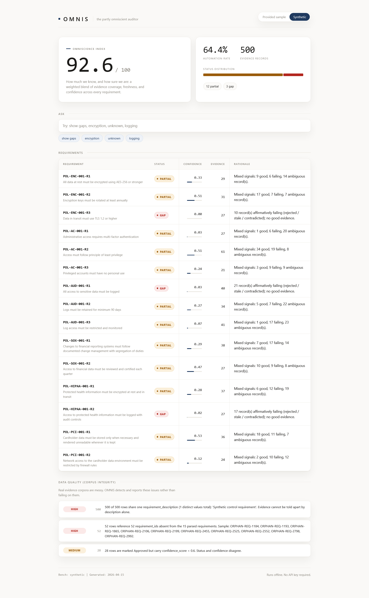
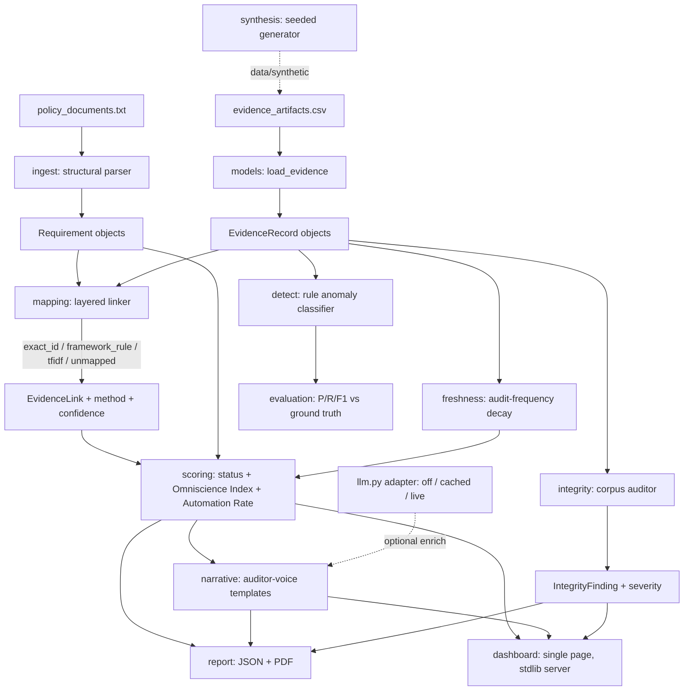

# OMNIS

### The partly omniscient auditor.

A compliance evidence engine that reads security policies, matches evidence against them, tracks how fresh that evidence is, and tells you one honest number: how much it actually knows.



---

## The problem, plainly

A bank has to prove it follows its own rules. Not just follow them, *prove* it, several times a year, to an auditor who will accept nothing less than the actual receipt: the config file, the rotation log, the access report.

The receipts are always scattered. One lives in AWS, one is a screenshot someone saved six months ago, one technically exists but nobody knows where. A compliance team spends 72+ hours per audit cycle as professional receipt-hunters, emailing five departments, stitching spreadsheets by hand. A control can be working perfectly and still fail the audit because nobody found the paperwork. You can be compliant and still lose.

OMNIS does that in under a second. Point it at the policies and the evidence pile, and it pulls out every requirement, links each one to its proof, flags anything stale or contradictory or missing, and writes back a report with one number at the top: the **Omniscience Index**, 0 to 100, measuring how much it actually knows and how much of that it trusts.

No auditor is omniscient. This one tells you exactly where the gaps are.

## The numbers

Two kinds of number matter here. What the product reports, and whether you should believe it.

**What it reports** (run `python -m omnis score`):

- **Omniscience Index 92.6 / 100** and **Automation Rate 64.4%** on the synthetic enterprise bench (15 requirements, 6 policies).
- **64.4 / 100** and **48.6%** on the provided sample, lower on purpose, because that data is a mess and the Index is honest about it.

**Whether to believe it:**

- **0.941 precision, 0.964 recall** on the synthetic bench. The bar was 0.70 and 0.60. (`make eval`)
- **0.043 seconds** to run the full pipeline on 5,000 evidence records. The bar was 60. Three orders of magnitude of headroom. (`make perf`)
- **97 tests**, all passing, one suite per module. (`make test`)

The split is the whole philosophy. The Index is the answer; precision, recall, and the tests are the receipt for the answer.

## We found something in the data

The provided dataset has a column called `anomaly_marker`, the supposed ground truth for which records are bad. We tested it before building against it.

It's noise. A permutation test against every feature in the data, and the labels predict nothing better than chance: best real precision 0.333, **permutation p-value 0.86**. The answer key was filled in by rolling dice.

Most teams will build a detector, score it against this column, and either overfit quietly or report confusing numbers without knowing why. We did three things instead:

1. Shipped the finding as a reproducible script (`make analyze`), so it's a verifiable fact, not a claim.
2. Built a synthetic bench where labels come from the data by construction, with injected noise so a passing score means real discrimination, not memorization.
3. Wired a `--labels` flag through the evaluator, so the moment the organizers release real ground truth, OMNIS re-grades itself in one command.

We built a compliance auditor. The first thing it audited was the benchmark.

## What it does

Six stages, none of them guess silently.

**Reads** policy documents into discrete requirements. The parser is deterministic and tolerates the actual messiness in the sample file, including a malformed lowercase `scope:` field that a stricter parser would silently drop.

**Links** each evidence record to a requirement through four fallback layers: exact ID match, then framework and type rules, then offline TF-IDF similarity, then an honest UNMAPPED verdict. Every link records which method found it and how confident it is. On the provided sample, every cited ID is an orphan that matches no real requirement, so exact match finds nothing and the lower layers carry the load. The layering is what gets coverage to zero unmapped on broken data.

**Tracks freshness.** Each requirement's own audit frequency sets its decay clock. Daily controls go stale in days, quarterly ones have months. Old proof loses weight automatically, and the stored freshness field (which disagrees with the dates on 455 of 500 sample rows) is thrown out and recomputed.

**Scores** every requirement: COMPLIANT, PARTIAL, GAP, or UNKNOWN, with a confidence and the evidence behind the call. UNKNOWN means "I found nothing," and it says so in plain language rather than pretending to a verdict it can't support.

**Explains.** Each verdict gets an auditor-voice narrative a human can read without decoding a status code.

**Totals.** Coverage, freshness, and confidence roll into the Omniscience Index and an Automation Rate. The Index isn't a vibe. The notebook decomposes it and shows the components sum to the score.

## The four hard cases

The problem statement specifically asks how you handle evidence that's missing, conflicting, low-confidence, or ambiguous. Each gets a named path, surfaced in both the dashboard and the report ([docs/EDGE_CASES.md](docs/EDGE_CASES.md)):

- **Missing** becomes UNKNOWN, and the narrative states the requirement is unproven.
- **Conflicting** and **ambiguous** resolve to PARTIAL, showing the good / failing / ambiguous split so the reasoning is visible.
- **Low-confidence** approved evidence gets caught by the integrity auditor as a status/confidence contradiction (18 such rows in the sample, marked Approved while carrying confidence below 0.6).

## The data is broken, and that's the point

The provided corpus is deliberately ugly, and a tool for real audits has to expect that. In the 500 sample rows OMNIS finds and reports, without crashing:

- **All 500** share one identical requirement description.
- Hundreds cite requirement IDs that exist in no policy (orphan references).
- **239 rows** were reviewed before they were collected, an impossible date order.
- **455 rows** carry a stored freshness value that disagrees with their own dates by more than a week.
- **18 rows** are marked Approved but carry low confidence.

A fragile tool dies on this. OMNIS treats it as the job: the integrity auditor catches each defect class, tags it with a severity, and reports it as a data-quality finding, because real evidence corpora look exactly this ugly.

## The report it produces

`python -m omnis report --bench synthetic` writes an auditor-ready PDF (and the same content as JSON) to `reports/`. A copy is committed at [reports/report.pdf](reports/report.pdf) so you can open it without running anything. It has three parts:

- An **executive summary**: the Omniscience Index, Automation Rate, and status counts.
- A **section per requirement**: status, confidence, the linked evidence, the freshness block, the narrative, and the recommended next step.
- An **integrity appendix**: every data-quality finding, by severity.

It is 8 KB. It is the artifact you would actually hand an auditor.

## Get it running

```bash
git clone https://github.com/ataylus/OMNIS.git
cd OMNIS
pip install -r requirements.txt

make demo      # dashboard at http://127.0.0.1:8000
make test      # 97 tests
make analyze   # reproduce the label finding yourself
```

Everything runs offline. No API key, no cloud, no cost.

```bash
python -m omnis run                      # parse + audit the provided sample: Index 64.4/100, 5 findings
python -m omnis score                    # both benches: synthetic Index 92.6/100, 15 requirements
python -m omnis eval                     # P 0.941, R 0.964 on the synthetic bench -> PASS
python -m omnis report --bench synthetic # auditor-ready JSON + PDF
python -m omnis perf --n 5000            # 0.043s on 5,000 rows -> PASS
```

Two benches. The **provided sample** (3 policies, 9 requirements, 500 rows) is the real-world stress test, the one with the signal-free labels and the broken dates. The **synthetic bench** (6 policies, 15 requirements) is generated by a seeded, configurable script that embeds its ground-truth labels by construction, restoring the advertised enterprise scope with data that means something. See [data/synthetic/DATA_CARD.md](data/synthetic/DATA_CARD.md).

## Architecture



Each box is a real module under `omnis/`. Each has its own test suite.

## Design decisions

- **Deterministic parser first.** Policy structure is structure; you parse it, you don't send it to a model and hope.
- **Layered linker, not a black box.** Cheap exact matches first, similarity only as fallback, loud UNMAPPED when nothing fits. An auditor's tool shows its work.
- **Rules before ML.** Transparent rules you can defend in a sentence beat an opaque model you can't, especially when the only labels on offer turned out to be noise.
- **Recompute, don't trust.** The stored freshness field is wrong on most rows, so OMNIS derives freshness from a fixed reference date instead, which also makes every run reproducible and keeps the tests from rotting.
- **stdlib dashboard.** One HTML file, no framework, no web fonts, no build step. It opens and works.

## LLM usage (and why it ships off)

There is one LLM adapter, `omnis/llm.py`, with three modes set by `OMNIS_LLM_MODE`:

- **off** (the shipped default): returns nothing, so every caller falls back to its deterministic template. The whole system runs end to end with no key, no network, and no cost. This is the mode judges get.
- **cached**: replays a response recorded during development from `data/llm_cache/`, keyed by a hash of the prompt. A cache miss falls back to the template.
- **live**: calls the Anthropic API only if a key is present, and logs every call to `reports/llm_calls.jsonl` with its purpose, token estimate, and a rough USD cost, so the spend is always visible.

The performance numbers above are measured with the LLM off. The model never sits on the critical path; it only enriches narrative prose when explicitly switched on. `data/llm_cache/` is not shipped and fills only on a deliberate live run.

## The notebook

[notebooks/omnis_analysis.ipynb](notebooks/omnis_analysis.ipynb) walks the full story: sample exploration, the label-independence finding with charts, the mapping method breakdown, and the Index decomposed into its parts. It uses the same functions as the CLI and runs top to bottom offline.

## Limitations

This is a proof of concept and it's honest about its edges. The evidence collectors are architected but mocked: the Automation Rate comes from evidence-type tagging, not live integrations ([docs/COLLECTORS.md](docs/COLLECTORS.md) describes how real ones would attach). The mapping is TF-IDF, a solid offline baseline, not semantic embeddings. The synthetic bench is labeled by construction plus injected noise, which is exactly why the provided sample, noisy labels and all, stays the primary real-world test rather than the easy one. Performance is measured on one laptop ([docs/PERFORMANCE.md](docs/PERFORMANCE.md)). And there are 15 requirements here, not the 500 a production deployment would carry, though at 0.043 seconds for 5,000 records and roughly linear scaling, headroom is not the worry.

## Layout

```
omnis/        the engine: ingest, integrity, mapping, freshness, scoring,
              detect, narrative, report, dashboard, evaluation, llm
data/         provided sample + synthetic bench (6 policies, 15 requirements)
docs/         edge cases, collectors, performance, hero image
notebooks/    the analysis end to end
scripts/      label_signal_analysis.py
tests/        97 tests, one suite per module
```

## License

[MIT](LICENSE).

---

Built solo for the Societe Generale iHACK MYPLACE hackathon, PS3. Team: **Partly Everything.**
